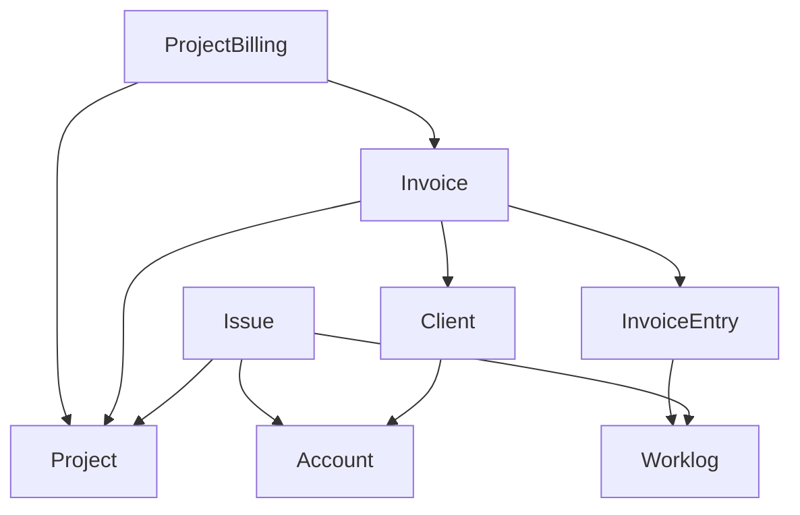

# CLAUDE.md

Guidance for Claude Code and other agents working in this repository.

## Run everything in the container

There is no host PHP, Composer or npm in this project. `Taskfile.yml` is the entrypoint — it wraps
`itkdev-docker-compose exec phpfpm`. Install it with `brew install go-task`.

```shell
task                              # list every task (task --list-all)
task setup                        # one-time: network, pull, npm install, up, composer install, migrate
task phpfpm -- bin/console <cmd>  # any console command
task composer -- <cmd>            # any composer command
task node -- npm run dev          # one-off node container
task compose -- <args>            # raw docker compose, e.g. task compose -- logs --follow node
```

## Commands

| Task | Command |
| --- | --- |
| Full test suite | `task test` |
| One test file | `task test:file -- tests/Unit/Service/FooTest.php` |
| Coverage, HTML | `task test:coverage` |
| Coverage gate | `task test:coverage:check` (threshold **62**) |
| Static analysis | `task code-analysis` |
| PHP + Twig standards | `task coding-standards:php:check` / `:php:apply` |
| JS standards, `assets/` only | `task coding-standards:js:check` / `:js:apply` |
| Markdown lint | `task compose -- run --rm markdownlint markdownlint '**/*.md'` |
| Migrations | `task db:migrate` |
| Fixtures | `task fixtures:load` |
| Consume the queue | `task messenger` |
| Assets | `task assets:dev` / `assets:watch` / `assets:build` |
| Everything before pushing | `task prepare-code` |

The `node` service in `docker-compose.override.yml` already runs `npm run watch`, so assets rebuild
on change. Use `task compose -- logs --tail 0 --follow node` to see compilation errors.

## Before you finish a change

1. `task prepare-code` — normalize, apply standards, PHPStan, tests.
2. `task composer -- normalize` if you touched `composer.json`.
3. Add a bullet to `CHANGELOG.md` under `## [Unreleased]`, keyed by PR link. **CI fails a PR whose
   `CHANGELOG.md` is identical to the base branch**, so this is not optional.
4. If you touched Markdown or YAML, they have their own CI gates:

   ```shell
   task compose -- run --rm markdownlint markdownlint '**/*.md'
   task compose -- run --rm prettier '**/*.{yml,yaml}' --check
   ```

## CI

`.github/workflows/pr.yml` runs on every PR: Doctrine schema validation, `composer code-analysis`,
and the test suite with `coverage-check coverage/clover.xml 62`.

The other workflows (`php.yaml`, `twig.yaml`, `composer.yaml`, `javascript.yaml`, `styles.yaml`,
`yaml.yaml`, `markdown.yaml`, `changelog.yaml`) are **copied from
[itk-dev/devops_itkdev-docker](https://github.com/itk-dev/devops_itkdev-docker) — do not hand-edit
them**; the same goes for `.markdownlint.jsonc` and the Prettier configs. `.woodpecker/` is legacy.

## Architecture

Economics syncs projects, issues and worklogs from a project tracker and turns them into invoices,
billing runs and management reports. Feature areas, one controller group each: Invoices, Project
Billing, Planning, Products, Service Agreements, Subscriptions, Cybersecurity, and the report suite
(Hour, Workload, Forecast, InvoicingRate, BillableUnbilledHours, Management).

### Layout

| Directory | Contents |
| --- | --- |
| `src/Controller` | Thin controllers, one per feature area |
| `src/Service` | Business logic, including `*ReportService.php` |
| `src/Entity`, `src/Entity/Trait` | Doctrine entities; shared mapped fields as traits |
| `src/Repository` | Query logic — keep DQL out of services |
| `src/Command` | Console commands (see below) |
| `src/Model` | DTOs, **not** entities — see below |
| `src/Form` | Form types, including the `*FilterType` bound to filter DTOs |
| `src/Enum` | PHP enums, mapped via `enumType:` on `#[ORM\Column]` |
| `src/Message`, `src/MessageHandler` | Messenger messages and handlers |
| `src/Interface` | `DataProviderInterface`, `ProtectedInterface` |
| `src/Security` | `AzureOIDCAuthenticator` and voters |
| `src/Doctrine/Extensions/DBAL/Types` | Custom DBAL types |
| `src/DataFixtures` | `AppFixtures`, loaded by the test bootstrap |

### Entity model



Everything is built around invoices: an invoice belongs to a project and consists of invoice entries,
which are either manual or backed by worklogs. Alongside the graph above there are `Version`
(Leantime milestones), `Epic`, `Worker`/`WorkerGroup`, `Product`/`IssueProduct`, `ServiceAgreement`,
`Subscription` and `DataProvider`.

### `src/Model` holds DTOs

Three families, and new code should follow the matching one rather than invent a shape:

* `Model/DataProvider/*Data` — payloads decoded from the tracker during sync.
* `Model/Invoices/*FilterData` — form-backed filter objects, bound to `src/Form/*FilterType.php`.
* `Model/Reports/*ReportFormData` and `*ReportData` — a report service in
  `src/Service/*ReportService.php` takes the `*FormData` and returns the `*ReportData`.

### Integration

Leantime is the only data provider. `src/Service/LeantimeApiService.php` implements
`src/Interface/DataProviderInterface.php`, and `DataProviderService::IMPLEMENTATIONS`
(`src/Service/DataProviderService.php:34`) is the registry.

Authentication is Azure OIDC — `src/Security/AzureOIDCAuthenticator.php` plus
`itk-dev/openid-connect-bundle`, with the role hierarchy in `config/packages/security.yaml` and
`src/Enum/RolesEnum.php`.

### Console commands

`app:data-providers:sync`, `app:data-providers:sync-modified`, `app:data-providers:sync-deleted`,
`app:data-provider:create`, `app:data-provider:list`, `app:data-provider:set-enable`,
`app:products:import`, `app:calc-sums`, `app:handle-subscriptions`, `app:anonymize-worklogs`,
`app:user:set-roles`.

`task phpfpm -- bin/console list app` is the authority if this list falls behind.

## Gotchas

* **Doctrine ORM 2, not 3.** `doctrine/orm` is pinned at `^2.13`; ORM 3 idioms will not work.

* **Data provider credentials live in the database**, not in config. A `DataProvider` row holds the
  URL and token, which is why `app.leantime.http_client` is hand-built in `config/services.yaml`: a
  scoped client keys on `base_uri`, and this base URI is only known at runtime. Create providers with
  `app:data-provider:create`.

* **Sync is Messenger-paged, and the transport choice is semantic.** A page dispatches its successor
  only once it has succeeded (`LeantimeApiService::LIMIT = 100`), with `TransportNamesStamp` selecting
  `async` or `sync`. `deleteAll()` must stay on `sync` so `DELETED_TYPES` runs
  timesheets → tickets → milestones → projects, children before parents
  (`src/Service/LeantimeApiService.php`).

* **Retry policy is split across three places, deliberately. Don't consolidate it.**
  * Handlers rethrow only 408, 423, 425 and 429 for the transport to retry; every other 4xx becomes
    an `UnrecoverableMessageHandlingException`, because a retry budget cannot change the request
    (`src/MessageHandler/Trait/RethrowsTransientHttpFailuresTrait.php`).
  * The `async` transport spaces its three attempts 10s/30s/90s
    (`config/packages/messenger.yaml`) — wide because a page waiting to retry is that entity type's
    whole sync waiting with it.
  * `app.leantime.http_client` is **not** a `RetryableHttpClient`. Retrying underneath the queue only
    hides the failure from it. It caps `timeout: 5` and `max_duration: 30`; if one page ever needs
    longer, lower `LeantimeApiService::LIMIT` instead of raising the cap.
  * The supervisor worker runs without `--failure-limit`
    (`docker-compose.server.override.yml`) — the listener counts retryable failures too, so any limit
    stopped the only worker on the first transient error.

* **Soft-delete-by-source.** `SynchronizedEntityTrait` adds `fetchDate`, `sourceModifiedDate` and
  `sourceDeletedDate`. An upsert is skipped when `sourceModifiedDate` is unchanged, unless
  `$disableModifiedAtCheck` is passed; a row that cannot be hard-deleted just gets `sourceDeletedDate`
  and is never revisited.

* **Known interface drift.** `DataProviderInterface` declares only `updateAll()` and `update()`,
  neither carrying the `$disableModifiedAtCheck` argument that `LeantimeApiService` and `SyncCommand`
  use, and `deleteAll()` is not declared at all. Don't "fix" this by dropping arguments at the call
  sites.

* **Doctrine specifics** in `config/packages/doctrine.yaml`: `datetime` and `datetime_immutable` are
  remapped to Europe/Copenhagen types, the Gedmo `softdeleteable` filter is enabled globally,
  `messenger_messages` is excluded via `schema_filter`, and MySQL DQL date functions are registered.
  Entities extend `AbstractBaseEntity` (Blameable + Timestampable).

* **PHPStan runs at level 8** over `src` and `tests`, with a large `phpstan-baseline.neon`. New code
  must be clean — never regenerate the baseline to silence a new error.

* **`ProtectedInterface`** blocks deletion through a `preRemove` listener
  (`src/EventListener/ProtectedDeletableSubscriber.php`). It currently has no implementers, so that
  path is untested.

* **Locale is `da`** with `en` as fallback, but only `translations/messages.da.yaml` exists. Put new
  user-facing strings in the Danish catalogue.

## Tests

`phpunit.xml.dist` defines two suites: `unit` over `tests/Unit` (`Command`, `Enum`, `EventListener`,
`MessageHandler`, `Service`, `Twig`) and `integration` over `tests/Integration` (`Controller`,
`Repository`, `Service`).

Two things surprise people:

* **`tests/bootstrap.php` rebuilds the database itself** on every run — clear cache, drop, create,
  migrate, load `AppFixtures`. Nothing else sets the test database up.
* **There is no DAMADoctrineTestBundle.** Tests are not wrapped in transactions and are not isolated
  from each other, so a test that writes must clean up after itself.

`tests/bootstrap_unit.php` is the database-free bootstrap used by `composer tests-unit`. Fixture users
for each role (`admin@test.local` and friends) and the login helpers live in
`tests/Integration/Controller/AbstractControllerTestCase.php`.

## Stack

PHP `>=8.3` (containers run `itkdev/php8.4-fpm`), Symfony `7.4.*` pinned via
`extra.symfony.require`, Doctrine ORM `^2.13`, Gedmo `^3.9`, `itk-dev/openid-connect-bundle ^4.0`,
KnpPaginator `^6.1`, Webpack Encore with Stimulus and Tailwind, mPDF / PhpSpreadsheet / OpenSpout for
exports, PHPUnit `^10.2`, PHPStan `^2.1`. MariaDB, with AMQP and Doctrine Messenger transports.
