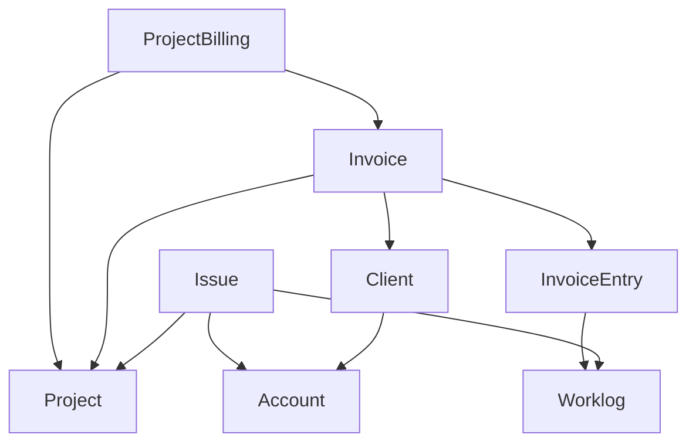

<!-- ABOUT THE PROJECT -->

## Economics

Economics is designed to integrate with project/issue trackers (like Jira, Leantime) to ease project management and
billing processes.

It synchronizes projects, issues and worklogs from external project trackers and




<!-- GETTING STARTED -->

## Getting Started

### Installation

1. Run initilization script
   ```sh
   task start
   ```
2. Open site
   ```sh
   itkdev-docker-compose open
   ```
3. Login with OIDC
4. Assign roles to your user
   ```sh
   task user:set-roles
   ```
5. Reload page and you should have access to everything.

### Fixtures

You can either load in fixtures or synchronize data from an actual project tracker.

To load fixtures

   ```sh
   task fixtures:load
   ```

## Data Synchronization

### Data provider
To synchronize data, we need to setup a data provider.

1. Create data-provider
    ```sh
    task data-provider:create
    ```
2. Enter name
3. Enter the base url of the project tracker (e.g. https://leantime.whatever.com)
4. Enter secret
5. Use up-down arrows to select implementation class
    * A class is implemented for each supported project tracker

### Synchronize projects
Before issues and worklogs can be synchronized, projects need to be synchronized and enabled.

1.
### Synchronize issues/worklogs

<p align="right">(<a href="#readme-top">back to top</a>)</p>
