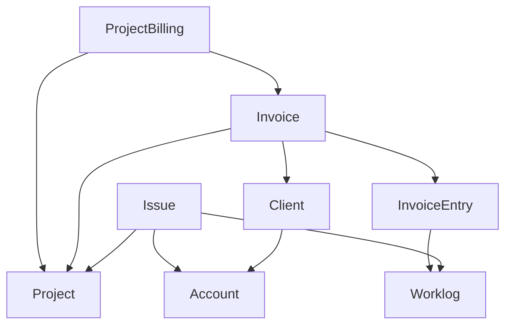

# Economics

[![Woodpecker](https://img.shields.io/badge/woodpecker-prod|stg-blue.svg?style=flat-square&logo=data:image/svg+xml;base64,PHN2ZyB4bWxucz0iaHR0cDovL3d3dy53My5vcmcvMjAwMC9zdmciIHdpZHRoPSIyMiIgaGVpZ2h0PSIyMiI+PHBhdGggZmlsbD0iI2ZmZiIgZD0iTTEuMjYzIDIuNzQ0QzIuNDEgMy44MzIgMi44NDUgNC45MzIgNC4xMTggNS4wOGwuMDM2LjAwN2MtLjU4OC42MDYtMS4wOSAxLjQwMi0xLjQ0MyAyLjQyMy0uMzggMS4wOTYtLjQ4OCAyLjI4NS0uNjE0IDMuNjU5LS4xOSAyLjA0Ni0uNDAxIDQuMzY0LTEuNTU2IDcuMjY5LTIuNDg2IDYuMjU4LTEuMTIgMTEuNjMuMzMyIDE3LjMxNy42NjQgMi42MDQgMS4zNDggNS4yOTcgMS42NDIgOC4xMDdhLjg1Ny44NTcgMCAwMC42MzMuNzQ0Ljg2Ljg2IDAgMDAuOTIyLS4zMjNjLjIyNy0uMzEzLjUyNC0uNzk3Ljg2LTEuNDI0Ljg0IDMuMzIzIDEuMzU1IDYuMTMgMS43ODMgOC42OTdhLjg2Ni44NjYgMCAwMDEuNTE3LjQxYzIuODgtMy40NjMgMy43NjMtOC42MzYgMi4xODQtMTIuNjc0LjQ1OS0yLjQzMyAxLjQwMi00LjQ1IDIuMzk4LTYuNTgzLjUzNi0xLjE1IDEuMDgtMi4zMTggMS41NS0zLjU2Ni4yMjgtLjA4NC41NjktLjMxNC43OS0uNDQxbDEuNzA3LS45ODEtLjI1NiAxLjA1MmEuODY0Ljg2NCAwIDAwMS42NzguNDA4bC42OC0yLjg1OCAxLjI4NS0yLjk1YS44NjMuODYzIDAgMTAtMS41ODEtLjY4N2wtMS4xNTIgMi42NjktMi4zODMgMS4zNzJhMTguOTcgMTguOTcgMCAwMC41MDgtMi45ODFjLjQzMi00Ljg2LS43MTgtOS4wNzQtMy4wNjYtMTEuMjY2LS4xNjMtLjE1Ny0uMjA4LS4yODEtLjI0Ny0uMjYuMDk1LS4xMi4yNDktLjI2LjM1OC0uMzc0IDIuMjgzLTEuNjkzIDYuMDQ3LS4xNDcgOC4zMTkuNzUuNTg5LjIzMi44NzYtLjMzNy4zMTYtLjY3LTEuOTUtMS4xNTMtNS45NDgtNC4xOTYtOC4xODgtNi4xOTMtLjMxMy0uMjc1LS41MjctLjYwNy0uODktLjkxM0M5LjgyNS41NTUgNC4wNzIgMy4wNTcgMS4zNTUgMi41NjljLS4xMDItLjAxOC0uMTY2LjEwMy0uMDkyLjE3NW0xMC45OCA1Ljg5OWMtLjA2IDEuMjQyLS42MDMgMS44LTEgMi4yMDgtLjIxNy4yMjQtLjQyNi40MzYtLjUyNC43MzgtLjIzNi43MTQuMDA4IDEuNTEuNjYgMi4xNDMgMS45NzQgMS44NCAyLjkyNSA1LjUyNyAyLjUzOCA5Ljg2LS4yOTEgMy4yODgtMS40NDggNS43NjMtMi42NzEgOC4zODUtMS4wMzEgMi4yMDctMi4wOTYgNC40ODktMi41NzcgNy4yNTlhLjg1My44NTMgMCAwMC4wNTYuNDhjMS4wMiAyLjQzNCAxLjEzNSA2LjE5Ny0uNjcyIDkuNDZhOTYuNTg2IDk2LjU4NiAwIDAwLTEuOTctOC43MTFjMS45NjQtNC40ODggNC4yMDMtMTEuNzUgMi45MTktMTcuNjY4LS4zMjUtMS40OTctMS4zMDQtMy4yNzYtMi4zODctNC4yMDctLjIwOC0uMTgtLjQwMi0uMjM3LS40OTUtLjE2Ny0uMDg0LjA2LS4xNTEuMjM4LS4wNjIuNDQ0LjU1IDEuMjY2Ljg3OSAyLjU5OSAxLjIyNiA0LjI3NiAxLjEyNSA1LjQ0My0uOTU2IDEyLjQ5LTIuODM1IDE2Ljc4MmwtLjExNi4yNTktLjQ1Ny45ODJjLS4zNTYtMi4wMTQtLjg1LTMuOTUtMS4zMy01Ljg0LTEuMzgtNS40MDYtMi42OC0xMC41MTUtLjQwMS0xNi4yNTQgMS4yNDctMy4xMzcgMS40ODMtNS42OTIgMS42NzItNy43NDYuMTE2LTEuMjYzLjIxNi0yLjM1NS41MjYtMy4yNTIuOTA1LTIuNjA1IDMuMDYyLTMuMTc4IDQuNzQ0LTIuODUyIDEuNjMyLjMxNiAzLjI0IDEuNTkzIDMuMTU2IDMuNDJ6bS0yLjg2OC42MmExLjE3NyAxLjE3NyAwIDEwLjczNi0yLjIzNiAxLjE3OCAxLjE3OCAwIDEwLS43MzYgMi4yMzd6Ii8+PC9zdmc+Cg==)](https://woodpecker.itkdev.dk/repos/19)
[](https://github.com/itk-dev/economics/releases)
[](https://github.com/itk-dev/economics/actions/workflows/pr.yml)
[](https://codecov.io/gh/itk-dev/economics)
[](https://github.com/itk-dev/economics/commits/develop/)
[](https://github.com/itk-dev/economics/blob/develop/LICENSE)

Economics is designed to integrate with project trackers (Jira, Leantime, etc.) to ease project management and
billing processes.

It synchronizes projects, issues and worklogs from external project trackers into its own database to allow
creation of useful dashboards and reports.



<!-- GETTING STARTED -->

## Development

### Getting Started

Run initialization script:

```sh
task start
```

Open website:

```sh
itkdev-docker-compose open
```

Login and afterward assign roles to your user

```sh
task user:set-roles
```

Reload page and you should have access to everything.

Create .env.local with the following values set:

```md
###> Project tracker connection ###
LEANTIME_PROJECT_TRACKER_URL=<VALUE>
LEANTIME_PROJECT_TRACKER_TOKEN=<VALUE>
###< Project tracker connection ###

###> itk-dev/openid-connect-bundle ###
USER_OIDC_METADATA_URL=<VALUE>
USER_OIDC_CLIENT_ID=<VALUE>
USER_OIDC_CLIENT_SECRET=<VALUE>
USER_OIDC_REDIRECT_URI=https://economics.local.itkdev.dk/openid-connect/generic
USER_OIDC_ALLOW_HTTP=<VALUE>
USER_OIDC_LEEWAY=<VALUE>
###< itk-dev/openid-connect-bundle ###

APP_INVOICE_RECEIVER_ACCOUNT=<VALUE>
APP_INVOICE_DEFAULT_DESCRIPTION=<VALUE>

###> symfony/mailer ###
MAILER_DSN=smtp://mail:1025
###< symfony/mailer ###
```

### Data

You have two options to get some data into the database.

You can either:

- [Load in fixtures](#fixtures)
- [Synchronize data](#synchronize-data) from an actual project tracker.

#### Fixtures

To load fixtures

```sh
task fixtures:load
```

#### Synchronize Data

##### Data provider

To synchronize data, we need to setup a data provider.

Create data-provider

```sh
task data-provider:create
```

- Enter name
- Enter the base url of the project tracker(e.g. <https://leantime.whatever.com>)
- Enter secret
- Use up-down arrows to select an implementation class
  - A class is implemented for each supported project tracker

##### Synchronize projects

Before issues and worklogs can be synchronized, projects need to be synchronized and "included".

Queue project and account sync jobs and consume the jobs

```sh
task queue:projects
task queue:accounts
task queue:consume-all
```

- Navigate to /admin/project/ and filter by "Not included"
- Include the projects you want to synchronize data for.

##### Synchronize issues/worklogs

After including the projects, you can synchronize issues and worklogs for these projects.

Queue issues and worklogs job and consume the jobs

- Note that this might take a while.

```sh
task queue:all
task queue:consume-all
```

All relevant data should now be synchronized to the database.

### Assets

The node container will watch for code changes in the `assets` folder and
recompile.

Use

```sh
task watch
```

to see the compilation log, e.g. to detect errors.

### Coding standards

Each PR is reviewed with Github Actions.

Check coding standards with:

```shell
task coding-standards:check
```

Apply coding standards with:

```shell
task coding-standards:apply
```

### Testing

The test setup follows the guidelines from: <https://symfony.com/doc/current/testing.html>.

To run tests:

```shell
task tests
```

DoctrineFixtures are load each time phpunit is run.
Between each test the initial state of the database is restored using DAMADoctrineTestBundle.

## Production

### Deployment

Deployment is done using Woodpecker.

Building of assets is handled by Github Actions.
