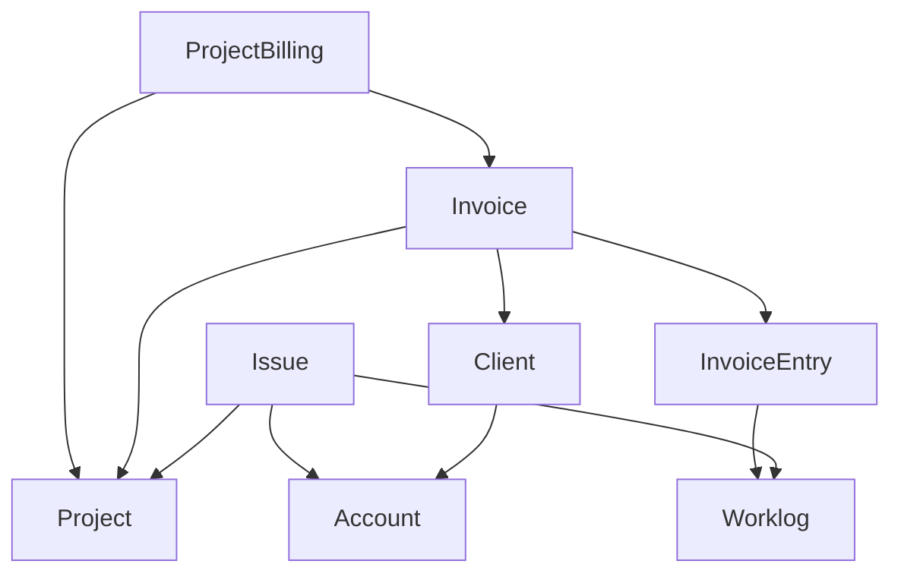

# Economics

Integration with project/issue tracker to ease management. The worklogs
and projects are synced from a project tracker (e.g. Jira).

The project consists of the following parts:

* Invoices: Create invoices for projects and clients. These can consist of manual
invoice entries and invoice entries created from worklogs.
* Project Billing: Automatically create invoices from a project for a given period.
* Planning: Overview of planned work for the coming sprints.
* Sprint Report: Detailed overview of the work for a given project/version.
* Projects: Overview of which projects to work with in the system.
* Project Creator: Create a new project in the Project Tracker.

## Entity model



The system is build around Invoices.
Each invoice is connected to a project and consists of invoice entries.
The output is a .csv file.

Projects, clients, accounts, issues and worklogs are synchronized from a project tracker.

Invoice entries can be manual entries or connected to a number of worklogs from
a project tracker.

Project billing can create a number of invoices for a given project for a given project.
Only issues from the project tracker that have a connected account will be included. This
is used to create invoices for the Support project, where issues are billed to different
accounts.

## Development

Getting started:

```shell
docker compose run --rm node npm install
docker compose up --detach
docker compose exec phpfpm composer install
docker compose exec phpfpm bin/console doctrine:migrations:migrate --no-interaction
```

Set create `.env.local` with the following values set

```shell
###> Project tracker connection ###
JIRA_PROJECT_TRACKER_URL=<VALUE>
JIRA_PROJECT_TRACKER_USER=<VALUE>
JIRA_PROJECT_TRACKER_TOKEN=<VALUE>
LEANTIME_PROJECT_TRACKER_URL=<VALUE>
LEANTIME_PROJECT_TRACKER_TOKEN=<VALUE>
###< Project tracker connection ###

###> itk-dev/openid-connect-bundle ###
USER_OIDC_METADATA_URL=<VALUE>
USER_OIDC_CLIENT_ID=<VALUE>
USER_OIDC_CLIENT_SECRET=<VALUE>
USER_OIDC_REDIRECT_URI=https://economics.local.itkdev.dk/openid-connect/generic
USER_OIDC_ALLOW_HTTP=<VALUE>
USER_OIDC_LEEWAY=<VALUE>
###< itk-dev/openid-connect-bundle ###

APP_INVOICE_RECEIVER_ACCOUNT=<VALUE>
APP_INVOICE_DEFAULT_DESCRIPTION=<VALUE>

JIRA_API_SERVICE_CUSTOM_FIELD_EPIC_LINK=<VALUE>
JIRA_API_SERVICE_CUSTOM_FIELD_ACCOUNT=<VALUE>
JIRA_API_SERVICE_CUSTOM_FIELD_SPRINT=<VALUE>
JIRA_API_SERVICE_DEFAULT_BOARD=<VALUE>
```

Sync projects and accounts.

```shell
docker compose exec phpfpm bin/console app:sync-projects
docker compose exec phpfpm bin/console app:sync-accounts
```

Visit /admin/project and "include" the projects that should be synchronized in the installation.

Then sync issues and worklogs

```shell
docker compose exec phpfpm bin/console app:sync-issues
docker compose exec phpfpm bin/console app:sync-worklogs
```

### Assets

The node container will watch for code changes in assets folder and recompile.

### Fixtures

We use [AliceBundle](https://github.com/theofidry/AliceBundle) for fixtures.

Load fixtures by running (**warning****: will empty your database!)

``` shell
docker compose exec phpfpm composer fixtures:load
```

After loading fixtures you can sign in as `admin@example.com`:

``` shell
open $(docker compose exec phpfpm bin/console itk-dev:openid-connect:login admin@example.com)
```

See [fixtures/user.yaml](fixtures/user.yaml) for additional info on users created when loading
fixtures.

## Migration path from JiraEconomics

1. Copy database from JiraEconomics.
2. Run migrate-from-jira-economics:

   ```shell
   bin/console app:migrate-from-jira-economics
   ```

   to prepare the database. This will remove a couple of tables and add the doctrine_migration_versions table
   with the Version20230101000000 migration marked as already run.
3. Execute the remaining migrations:

   ```shell
   bin/console doctrine:migrations:migrate
   ```

4. Run synchronizations:

   ```shell
   bin/console app:sync-projects
   bin/console app:sync-accounts
   ```

5. Run migrate-customer to migrate from invoice.customerAccountId to invoice.client

   ```shell
   bin/console app:migrate-customers
   ```

6. Visit /admin/project and "include" the projects that should be synchronized in the installation.
7. Synchronize issues and worklogs

   ```shell
   bin/console app:sync-issues
   bin/console app:sync-worklogs
   ```

### Coding standards

Each PR is reviewed with Github Actions.

Check coding standards with:

```shell
# Apply coding standards and run static analysis for php and twig
docker compose exec phpfpm composer coding-standards-check

# Check coding standards for assets and markdown
docker compose run --rm node npm run coding-standards-check
```

Apply some coding standards with:

```shell
# Apply coding standards and run static analysis for php and twig
docker compose exec phpfpm composer prepare-code

# Apply coding standards for assets and markdown
docker compose run --rm node npm run coding-standards-apply
```

### Code analysis

We use [Psalm](https://psalm.dev/) for static code analysis:

``` shell
docker compose exec phpfpm composer code-analysis
```

### Testing

The test setup follows the guidelines from: <https://symfony.com/doc/current/testing.html>.

To run tests:

```shell
docker compose exec phpfpm composer tests
```

DoctrineFixtures are load each time phpunit is run.
Between each test the initial state of the database is restored using DAMADoctrineTestBundle.

## Production

### Deploy

Build the assets locally

```shell
docker compose run --rm node npm run build
```

Copy the `/public/build` folder to the server.

```shell
docker compose up --detach
docker compose exec phpfpm composer install --no-dev --classmap-authoritative
docker compose exec phpfpm bin/console doctrine:migrations:migrate
```

### Sync

Run synchronization with a cron process with a given interval to synchronize with the project tracker:

 ```shell
   bin/console app:sync
```

## APIs

This project uses issue tracker API's to create and get information about projects.

### Jira

[https://docs.atlassian.com/software/jira/docs/api/REST/9.3.0/](https://docs.atlassian.com/software/jira/docs/api/REST/9.3.0/)
[https://docs.atlassian.com/jira-software/REST/9.5.0/](https://docs.atlassian.com/jira-software/REST/9.5.0/)

### Tempo

[https://www.tempo.io/server-api-documentation](https://www.tempo.io/server-api-documentation)

## publiccode.yml

This code adheres to the
[publiccode.yml](https://github.com/publiccodeyml/publiccode.yml) standard by
including a [`publiccode.yml`](publiccode.yml) metadata file that makes public
software easily discoverable. See [`publiccode.yml`](publiccode.yml) for details.

Validate the `publiccode.yml` file by running

```shell
docker run --interactive italia/publiccode-parser-go /dev/stdin < publiccode.yml
```

The validation is automatically performed by a GitHub Action whenever a pull
request is made (cf. [`.github/workflows/pr.yaml`](.github/workflows/pr.yaml)).
