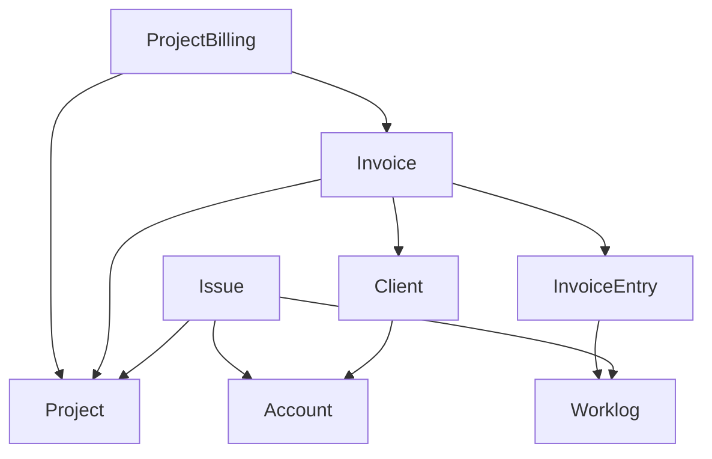

# Economics

[![Woodpecker](https://img.shields.io/badge/woodpecker-prod|stg-blue.svg?style=flat-square&logo=data:image/svg+xml;base64,PHN2ZyB4bWxucz0iaHR0cDovL3d3dy53My5vcmcvMjAwMC9zdmciIHdpZHRoPSIyMiIgaGVpZ2h0PSIyMiI+PHBhdGggZmlsbD0iI2ZmZiIgZD0iTTEuMjYzIDIuNzQ0QzIuNDEgMy44MzIgMi44NDUgNC45MzIgNC4xMTggNS4wOGwuMDM2LjAwN2MtLjU4OC42MDYtMS4wOSAxLjQwMi0xLjQ0MyAyLjQyMy0uMzggMS4wOTYtLjQ4OCAyLjI4NS0uNjE0IDMuNjU5LS4xOSAyLjA0Ni0uNDAxIDQuMzY0LTEuNTU2IDcuMjY5LTIuNDg2IDYuMjU4LTEuMTIgMTEuNjMuMzMyIDE3LjMxNy42NjQgMi42MDQgMS4zNDggNS4yOTcgMS42NDIgOC4xMDdhLjg1Ny44NTcgMCAwMC42MzMuNzQ0Ljg2Ljg2IDAgMDAuOTIyLS4zMjNjLjIyNy0uMzEzLjUyNC0uNzk3Ljg2LTEuNDI0Ljg0IDMuMzIzIDEuMzU1IDYuMTMgMS43ODMgOC42OTdhLjg2Ni44NjYgMCAwMDEuNTE3LjQxYzIuODgtMy40NjMgMy43NjMtOC42MzYgMi4xODQtMTIuNjc0LjQ1OS0yLjQzMyAxLjQwMi00LjQ1IDIuMzk4LTYuNTgzLjUzNi0xLjE1IDEuMDgtMi4zMTggMS41NS0zLjU2Ni4yMjgtLjA4NC41NjktLjMxNC43OS0uNDQxbDEuNzA3LS45ODEtLjI1NiAxLjA1MmEuODY0Ljg2NCAwIDAwMS42NzguNDA4bC42OC0yLjg1OCAxLjI4NS0yLjk1YS44NjMuODYzIDAgMTAtMS41ODEtLjY4N2wtMS4xNTIgMi42NjktMi4zODMgMS4zNzJhMTguOTcgMTguOTcgMCAwMC41MDgtMi45ODFjLjQzMi00Ljg2LS43MTgtOS4wNzQtMy4wNjYtMTEuMjY2LS4xNjMtLjE1Ny0uMjA4LS4yODEtLjI0Ny0uMjYuMDk1LS4xMi4yNDktLjI2LjM1OC0uMzc0IDIuMjgzLTEuNjkzIDYuMDQ3LS4xNDcgOC4zMTkuNzUuNTg5LjIzMi44NzYtLjMzNy4zMTYtLjY3LTEuOTUtMS4xNTMtNS45NDgtNC4xOTYtOC4xODgtNi4xOTMtLjMxMy0uMjc1LS41MjctLjYwNy0uODktLjkxM0M5LjgyNS41NTUgNC4wNzIgMy4wNTcgMS4zNTUgMi41NjljLS4xMDItLjAxOC0uMTY2LjEwMy0uMDkyLjE3NW0xMC45OCA1Ljg5OWMtLjA2IDEuMjQyLS42MDMgMS44LTEgMi4yMDgtLjIxNy4yMjQtLjQyNi40MzYtLjUyNC43MzgtLjIzNi43MTQuMDA4IDEuNTEuNjYgMi4xNDMgMS45NzQgMS44NCAyLjkyNSA1LjUyNyAyLjUzOCA5Ljg2LS4yOTEgMy4yODgtMS40NDggNS43NjMtMi42NzEgOC4zODUtMS4wMzEgMi4yMDctMi4wOTYgNC40ODktMi41NzcgNy4yNTlhLjg1My44NTMgMCAwMC4wNTYuNDhjMS4wMiAyLjQzNCAxLjEzNSA2LjE5Ny0uNjcyIDkuNDZhOTYuNTg2IDk2LjU4NiAwIDAwLTEuOTctOC43MTFjMS45NjQtNC40ODggNC4yMDMtMTEuNzUgMi45MTktMTcuNjY4LS4zMjUtMS40OTctMS4zMDQtMy4yNzYtMi4zODctNC4yMDctLjIwOC0uMTgtLjQwMi0uMjM3LS40OTUtLjE2Ny0uMDg0LjA2LS4xNTEuMjM4LS4wNjIuNDQ0LjU1IDEuMjY2Ljg3OSAyLjU5OSAxLjIyNiA0LjI3NiAxLjEyNSA1LjQ0My0uOTU2IDEyLjQ5LTIuODM1IDE2Ljc4MmwtLjExNi4yNTktLjQ1Ny45ODJjLS4zNTYtMi4wMTQtLjg1LTMuOTUtMS4zMy01Ljg0LTEuMzgtNS40MDYtMi42OC0xMC41MTUtLjQwMS0xNi4yNTQgMS4yNDctMy4xMzcgMS40ODMtNS42OTIgMS42NzItNy43NDYuMTE2LTEuMjYzLjIxNi0yLjM1NS41MjYtMy4yNTIuOTA1LTIuNjA1IDMuMDYyLTMuMTc4IDQuNzQ0LTIuODUyIDEuNjMyLjMxNiAzLjI0IDEuNTkzIDMuMTU2IDMuNDJ6bS0yLjg2OC42MmExLjE3NyAxLjE3NyAwIDEwLjczNi0yLjIzNiAxLjE3OCAxLjE3OCAwIDEwLS43MzYgMi4yMzd6Ii8+PC9zdmc+Cg==)](https://woodpecker.itkdev.dk/repos/19)
[](https://github.com/itk-dev/economics/releases)
[](https://github.com/itk-dev/economics/actions/workflows/pr.yml)
[](https://codecov.io/gh/itk-dev/economics)
[](https://github.com/itk-dev/economics/commits/develop/)
[](https://github.com/itk-dev/economics/blob/develop/LICENSE)

Integration with project/issue tracker to ease management. The worklogs
and projects are synced from a project tracker.

## Entity model



The system is build around Invoices.
Each invoice is connected to a project and consists of invoice entries.
The output is a .csv file.

Projects, clients, accounts, issues and worklogs are synchronized from a project tracker.

Invoice entries can be manual entries or connected to a number of worklogs from
a project tracker.

Project billing can create a number of invoices for a given project for a given project.
Only issues from the project tracker that have a connected account will be included. This
is used to create invoices for the Support project, where issues are billed to different
accounts.

## Synchronization

Economics depends on data fra external systems. The integrations with external systems are called Data Providers.

Each Data Provider integration should implement `App\Interface\DataProviderServiceInterface`.

The data synchronization is handled by symfony messenger. This is handled differently in development and production.

### Production

Supervisor is added to `docker-compose.server.override.yaml` to make sure the job queue is running.

Symfony scheduler is used for creating a new job each hour at minute 5. See `App\Command\QueueSyncCommand`.

### Develop

In development the job queue should be run manually.

```sh
docker compose exec phpfpm bin/console messenger:consume async -vv --failure-limit 1
```

### Queuing jobs

Jobs can be queued manually with App\Command\QueueSyncCommand

```sh
docker compose exec phpfpm bin/console app:queue-sync
```

Jobs can also be queued in the admin interface in the bottom left corner.

In production jobs are queued automatically each hour.

## Development

Getting started:

```shell
docker compose pull
docker compose run --rm node npm install
docker compose up --detach
docker compose exec phpfpm composer install
docker compose exec phpfpm bin/console doctrine:migrations:migrate --no-interaction
```

Set create `.env.local` with the following values set

```shell
###> Project tracker connection ###
JIRA_PROJECT_TRACKER_URL=<VALUE>
JIRA_PROJECT_TRACKER_USER=<VALUE>
JIRA_PROJECT_TRACKER_TOKEN=<VALUE>
LEANTIME_PROJECT_TRACKER_URL=<VALUE>
LEANTIME_PROJECT_TRACKER_TOKEN=<VALUE>
###< Project tracker connection ###

###> itk-dev/openid-connect-bundle ###
USER_OIDC_METADATA_URL=<VALUE>
USER_OIDC_CLIENT_ID=<VALUE>
USER_OIDC_CLIENT_SECRET=<VALUE>
USER_OIDC_REDIRECT_URI=https://economics.local.itkdev.dk/openid-connect/generic
USER_OIDC_ALLOW_HTTP=<VALUE>
USER_OIDC_LEEWAY=<VALUE>
###< itk-dev/openid-connect-bundle ###

APP_INVOICE_RECEIVER_ACCOUNT=<VALUE>
APP_INVOICE_DEFAULT_DESCRIPTION=<VALUE>

JIRA_API_SERVICE_CUSTOM_FIELD_EPIC_LINK=<VALUE>
JIRA_API_SERVICE_CUSTOM_FIELD_ACCOUNT=<VALUE>
JIRA_API_SERVICE_CUSTOM_FIELD_SPRINT=<VALUE>
JIRA_API_SERVICE_DEFAULT_BOARD=<VALUE>
```

Sync projects and accounts.

```shell
docker compose exec phpfpm bin/console app:sync-projects
docker compose exec phpfpm bin/console app:sync-accounts
```

Visit /admin/project and "include" the projects that should be synchronized in the installation.

Then sync issues and worklogs

```shell
docker compose exec phpfpm bin/console app:sync-issues
docker compose exec phpfpm bin/console app:sync-worklogs
```

### Assets

The node container will watch for code changes in the `assets` folder and
recompile.

Use

``` shell
docker compose logs --tail 0 --follow node
```

to see the compilation log, e.g. to detect errors.

### Coding standards

Each PR is reviewed with Github Actions.

Check coding standards with:

```shell
# Apply coding standards and run static analysis for php and twig
docker compose exec phpfpm composer coding-standards-check

# Check coding standards for assets and markdown
docker compose run --rm node npm run coding-standards-check
```

Apply some coding standards with:

```shell
# Apply coding standards and run static analysis for php and twig
docker compose exec phpfpm composer prepare-code

# Apply coding standards for assets and markdown
docker compose run --rm node npm run coding-standards-apply
```

### Code analysis

We use [Psalm](https://psalm.dev/) for static code analysis:

``` shell
docker compose exec phpfpm composer code-analysis
```

### Testing

The test setup follows the guidelines from: <https://symfony.com/doc/current/testing.html>.

To run tests:

```shell
docker compose exec phpfpm composer tests
```

DoctrineFixtures are load each time phpunit is run.
Between each test the initial state of the database is restored using DAMADoctrineTestBundle.

## Production

### Deploy

Build the assets locally

```shell
docker compose run --rm node npm run build
```

Copy the `/public/build` folder to the server.

```shell
docker compose up --detach
docker compose exec phpfpm composer install --no-dev --classmap-authoritative
docker compose exec phpfpm bin/console doctrine:migrations:migrate
```

### Sync

Run synchronization with a cron process with a given interval to synchronize with the project tracker:

 ```shell
   bin/console app:sync
```

## Importing products

We need an initial product import to get going. Use

``` shell
docker compose exec phpfpm bin/console app:product:import «CSV filename»
```

to import from a CSV file.

The CSV **must** contain the following headers:

``` csv
id,name,price,project.id,project.name
```
