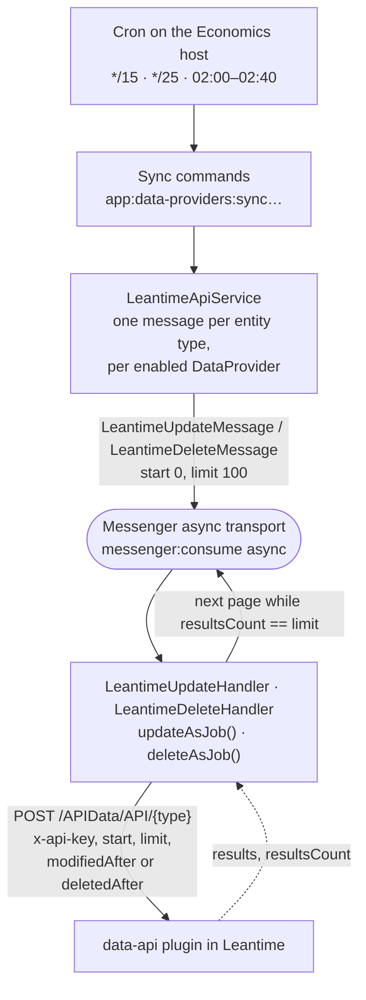
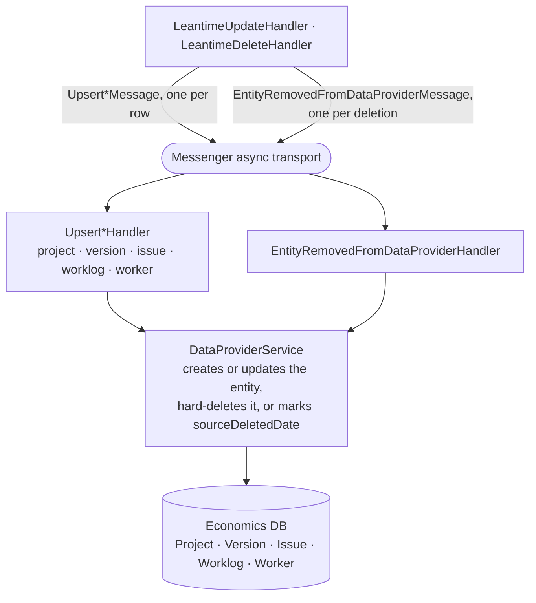
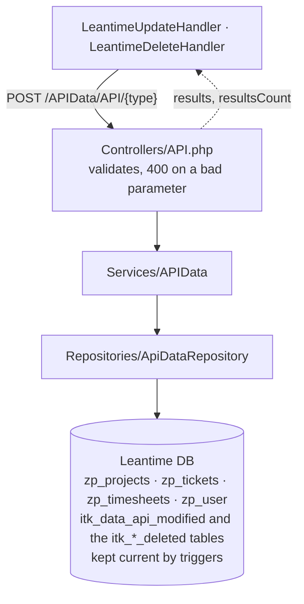
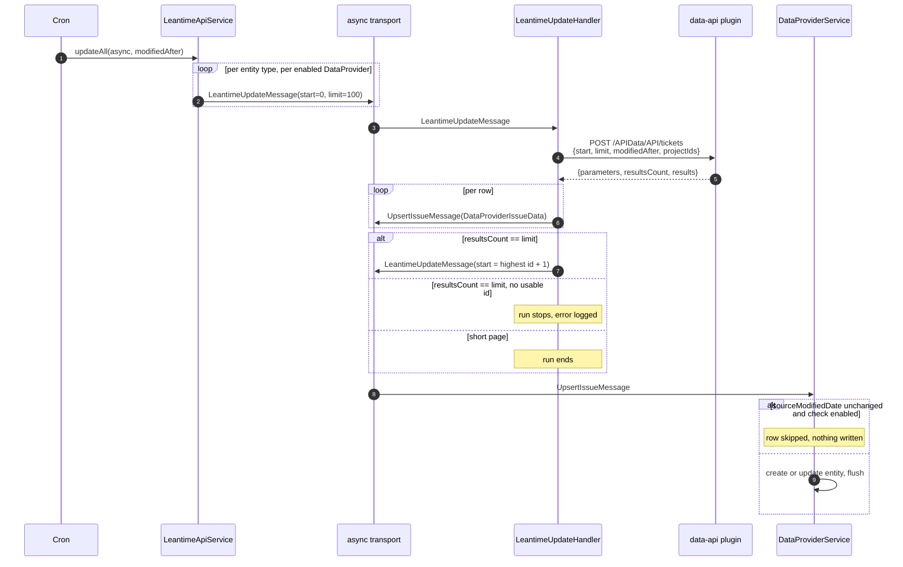

# Synchronization from Leantime

Economics does not talk to Leantime directly. Leantime runs the
[data-api plugin](https://github.com/itk-dev/data-api), which exposes read-only endpoints under
`/APIData/API/`, and Economics pulls from those endpoints on a schedule. Nothing is pushed from
Leantime; every sync starts as a cron job on the Economics host.

The pull is paged, incremental and queue driven: a command dispatches one message per entity type,
each message fetches one page of at most 100 rows, dispatches one upsert message per row, and
re-dispatches itself for the next page until a short page ends the run.

The three flowcharts below split that structure into the parts worth looking at separately, and the
sequence diagram after them follows a single update run end to end. Throughout, a solid arrow is a
message dispatched or a request sent, and a dashed arrow is a response.

## Fetching a page

Everything above assumes async handling (`-j`). Without it the same messages are stamped for the
`sync://` transport and run inline in the cron process instead of going through the queue — which is
what `app:data-providers:sync-deleted` does, deliberately. Read **Delete ordering** below before
changing that.

## Turning a page into rows

## The plugin side

## One update run, page by page

## Scheduled jobs

Installed by the release playbook, see `.woodpecker/prod_itk_economics.yml`.

| Job | Schedule | Command |
| --- | --- | --- |
| `sync-modified` | every 15 min | `app:data-providers:sync-modified` (window `PT1H`, async) |
| `sync-deleted` | every 25 min | `app:data-providers:sync-deleted` (window `PT1H`, handled inline) |
| `sync-deleted-week` | 02:50 | `app:data-providers:sync-deleted --interval=P1W` |
| `full-sync-projects` | 02:00 | `app:data-providers:sync -j -p -d` |
| `full-sync-workers` | 02:10 | `app:data-providers:sync -j -r -d` |
| `full-sync-versions` | 02:20 | `app:data-providers:sync -j -s -d` |
| `full-sync-issues` | 02:30 | `app:data-providers:sync -j -i -d` |
| `full-sync-worklogs` | 02:40 | `app:data-providers:sync -j -w -d` |

A single supervisor worker consumes the `async` transport — `APP_SUPERVISOR_WORKERS=1` and
`messenger:consume --time-limit=900` in `docker-compose.server.override.yml`. That is why the full
syncs are staggered ten minutes apart: a full run of one entity type takes a while, and nothing else
drains the queue while it does.

## Command options

`app:data-providers:sync` selects what to sync and how:

* `-j`, `--job`: dispatch to the `async` transport instead of handling everything inline.
* `-a`, `--all`, or one of `-p` projects, `-s` versions, `-i` issues, `-w` worklogs, `-r` workers.
* `--modified`: only fetch rows changed since the given date, passed on as `modifiedAfter`.
* `-d`, `--disable-modified-at-check`: write every fetched row even when its modified timestamp is
  unchanged. The nightly full syncs use this to repair rows that drifted out of sync.

`sync-modified` and `sync-deleted` take `--interval` (a `DateInterval` string, default `PT1H`) and
derive `modifiedAfter` / `deletedAfter` from it.

## Details worth knowing

* **Entity mapping.** Leantime milestones become Economics `Version`, tickets become `Issue`,
  timesheets become `Worklog`, users become `Worker`.
* **Project scoping.** Milestones, tickets and timesheets are requested only for the project ids
  Economics already knows and includes (`ProjectRepository::getProjectTrackerIdsByDataProviders()`).
  Projects and workers are fetched unscoped, so a new project has to be synced before its content
  can follow.
* **Paging.** On the entity endpoints `start` is an id cursor, not an offset: the next page starts at
  the highest usable id on the page plus one. The delete endpoint pages on `deletionId` instead — the
  deletion's own row id, not the deleted entity's. Deletions are ordered by when they happened while
  the entity ids on a page are in no order at all, so paging on them would skip deletions. A page
  shorter than the limit ends the run either way.
* **Incrementality.** `modifiedAfter` filters on `itk_data_api_modified`, a column the plugin adds to
  the Leantime tables and keeps current with triggers, because Leantime does not update its own
  `modified` column on every write path.
* **Deletions.** Leantime rows are gone by the time Economics asks, so the plugin records them in
  `itk_projects_deleted`, `itk_tickets_deleted` and `itk_timesheets_deleted` via triggers, and the
  `deleted` endpoint reads those tables. It serves one type per request: `deleteAsJob()` sends `type`,
  `start`, `limit` and `deletedAfter`, and pages the way the entity endpoints do. The cursor advances
  past a deletion that names no entity, because a skipped row still occupies a page position; a full
  page with no usable `deletionId` stops the run with a logged error rather than re-queueing itself,
  which would re-read the same page until the queue starves.
* **Delete ordering.** The delete types run timesheets → tickets → milestones → projects, children
  before the parents they hang off. What holds that order is the inline `sync://` transport rather
  than the dispatch order: `deleteAll()` passes `asyncJobQueue` false, so every page of one type is
  handled before the next type is dispatched. On the `async` transport the four types interleave, and
  a project can be reached while its timesheets are still a page behind. That matters because a
  parent which cannot be hard-deleted is only marked with `sourceDeletedDate`, and nothing revisits
  the mark — so `sync-deleted` running inline is load-bearing, not an oversight to fix with `-j`.
* **What blocks a removal.** `DataProviderService` hard-deletes an entity only when nothing points at
  it. A project is kept if it still has invoices, issues, worklogs, versions, project billings or
  service agreements; an issue is kept if it still has worklogs. Each of those points back with a
  non-nullable, non-cascading foreign key, so removing anyway would be a database error rather than a
  soft delete. Versions are always removable.
* **First sync after a plugin install returns everything**, because installing stamps every existing
  row with the install time.
* **Failures.** A handler that fails with 408, 423, 425 or 429 rethrows, so the `async` transport
  retries the message: three attempts spaced 10s, 30s and 90s, the last landing 130s after the first
  failure. Any other 4xx describes the request itself, which no retry can change, so it becomes an
  `UnrecoverableMessageHandlingException`, lands in the `failed` transport and is logged. Requests to
  Leantime are capped at `timeout: 5` and `max_duration: 30` by `app.leantime.http_client`, so no
  single page can hold the worker indefinitely.
* **Retries are an `async` transport feature only.** `sync://` has no retry strategy, so the inline
  `sync-deleted` run gets none: a failure there propagates out to the command.
* **Authentication.** Each `DataProvider` row holds the Leantime base url and the API key sent as
  `x-api-key`. Only providers with `class = App\Service\LeantimeApiService` and `enabled = true` are
  synced.
