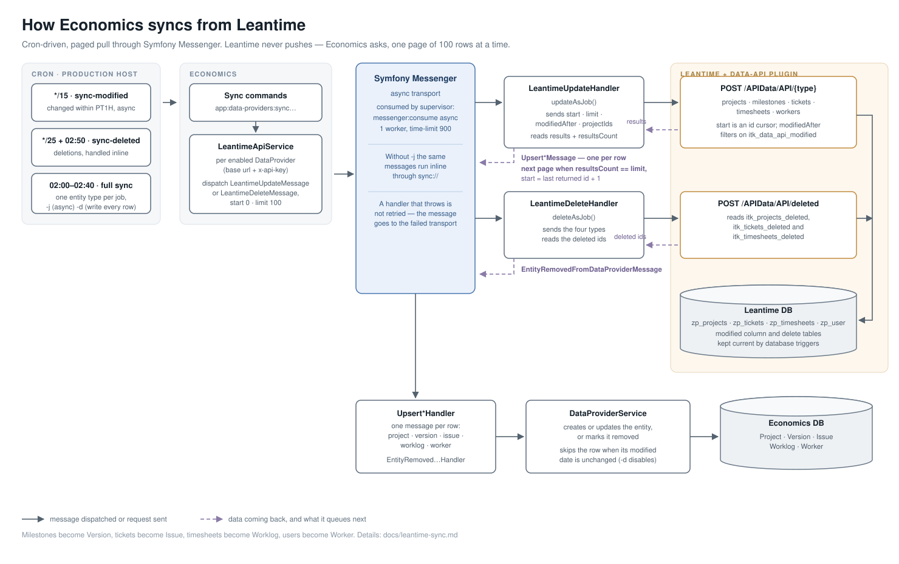
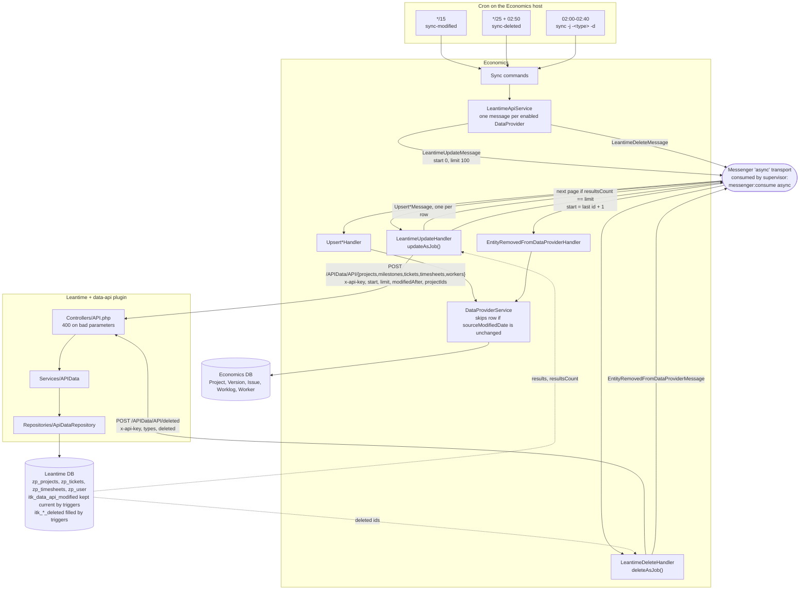
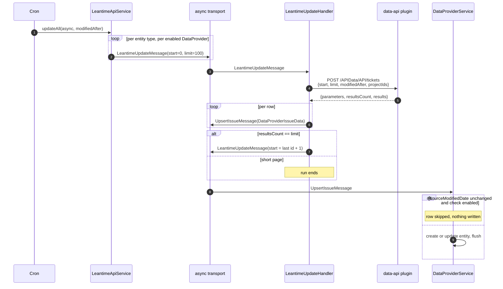

# Synchronization from Leantime

Economics does not talk to Leantime directly. Leantime runs the
[data-api plugin](https://github.com/itk-dev/data-api), which exposes read-only endpoints under
`/APIData/API/`, and Economics pulls from those endpoints on a schedule. Nothing is pushed from
Leantime; every sync starts as a cron job on the Economics host.

The pull is paged, incremental and queue driven: a command dispatches one message per entity type,
each message fetches one page of at most 100 rows, dispatches one upsert message per row, and
re-dispatches itself for the next page until a short page ends the run.

## The pipeline

Everything above assumes async handling (`-j`). Without it the same messages are stamped for the
`sync://` transport and run inline in the cron process instead of going through the queue — which is
what `app:data-providers:sync-deleted` does.

## One update run, page by page

## Scheduled jobs

Installed by the release playbook, see `.woodpecker/prod_itk_economics.yml`.

| Job | Schedule | Command |
| --- | --- | --- |
| `sync-modified` | every 15 min | `app:data-providers:sync-modified` (window `PT1H`, async) |
| `sync-deleted` | every 25 min | `app:data-providers:sync-deleted` (window `PT1H`, handled inline) |
| `sync-deleted-week` | 02:50 | `app:data-providers:sync-deleted --interval=P1W` |
| `full-sync-projects` | 02:00 | `app:data-providers:sync -j -p -d` |
| `full-sync-workers` | 02:10 | `app:data-providers:sync -j -r -d` |
| `full-sync-versions` | 02:20 | `app:data-providers:sync -j -s -d` |
| `full-sync-issues` | 02:30 | `app:data-providers:sync -j -i -d` |
| `full-sync-worklogs` | 02:40 | `app:data-providers:sync -j -w -d` |

The full syncs are staggered ten minutes apart because one worker consumes the queue and a full run
of one entity type takes a while.

## Command options

`app:data-providers:sync` selects what to sync and how:

* `-j`, `--job`: dispatch to the `async` transport instead of handling everything inline.
* `-a`, `--all`, or one of `-p` projects, `-s` versions, `-i` issues, `-w` worklogs, `-r` workers.
* `--modified`: only fetch rows changed since the given date, passed on as `modifiedAfter`.
* `-d`, `--disable-modified-at-check`: write every fetched row even when its modified timestamp is
  unchanged. The nightly full syncs use this to repair rows that drifted out of sync.

`sync-modified` and `sync-deleted` take `--interval` (a `DateInterval` string, default `PT1H`) and
derive `modifiedAfter` / `deleted` from it.

## Details worth knowing

* **Entity mapping.** Leantime milestones become Economics `Version`, tickets become `Issue`,
  timesheets become `Worklog`, users become `Worker`.
* **Project scoping.** Milestones, tickets and timesheets are requested only for the project ids
  Economics already knows and includes (`ProjectRepository::getProjectTrackerIdsByDataProviders()`).
  Projects and workers are fetched unscoped, so a new project has to be synced before its content
  can follow.
* **Paging.** `start` is an id cursor, not an offset: the next page starts at the last returned id
  plus one. A page shorter than the limit ends the run.
* **Incrementality.** `modifiedAfter` filters on `itk_data_api_modified`, a column the plugin adds to
  the Leantime tables and keeps current with triggers, because Leantime does not update its own
  `modified` column on every write path.
* **Deletions.** Leantime rows are gone by the time Economics asks, so the plugin records them in
  `itk_projects_deleted`, `itk_tickets_deleted` and `itk_timesheets_deleted` via triggers, and the
  `deleted` endpoint reads those tables.
* **First sync after a plugin install returns everything**, because installing stamps every existing
  row with the install time.
* **Failures.** A handler that throws wraps the error in `UnrecoverableMessageHandlingException`, so
  the message is not retried; it lands in the `failed` transport and the reason is logged.
* **Authentication.** Each `DataProvider` row holds the Leantime base url and the API key sent as
  `x-api-key`. Only providers with `class = App\Service\LeantimeApiService` and `enabled = true` are
  synced.
